# DNA Engine — Documentação Completa

> **Versão:** 1.0 | **Plataforma:** Snowflake Streamlit (Snowpark) | **Idioma:** Português

---

## Sumário

1. [Visão Geral do Projeto](#1-visão-geral-do-projeto)
2. [Arquitetura da Solução](#2-arquitetura-da-solução)
3. [Modelo de Dados](#3-modelo-de-dados)
4. [Configuração e Instalação](#4-configuração-e-instalação)
5. [Fluxo Geral da Aplicação](#5-fluxo-geral-da-aplicação)
6. [Aba 1 — Criar Nova Regra](#6-aba-1--criar-nova-regra)
   - 6.1 [Regra Simples](#61-regra-simples)
   - 6.2 [Regra Composta](#62-regra-composta)
7. [Aba 2 — Gestão do Dicionário](#7-aba-2--gestão-do-dicionário)
8. [Aba 3 — Processamento Global (Sala de Controle)](#8-aba-3--processamento-global-sala-de-controle)
   - 8.1 [Motor Fase 1 — Regras Simples](#81-motor-fase-1--regras-simples)
   - 8.2 [Motor Fase 2 — Regras Compostas](#82-motor-fase-2--regras-compostas)
9. [Aba 4 — Auditoria de Regras](#9-aba-4--auditoria-de-regras)
10. [Aba 5 — Visualizar Base](#10-aba-5--visualizar-base)
11. [Referência Técnica das Funções](#11-referência-técnica-das-funções)
12. [Glossário](#12-glossário)
13. [Guia do Operador (Usuário Final)](#13-guia-do-operador-usuário-final)
14. [Guia do Desenvolvedor](#14-guia-do-desenvolvedor)

---

## 1. Visão Geral do Projeto

O **DNA Engine** é uma aplicação de inteligência analítica em saúde, construída inteiramente dentro do **Snowflake** usando **Streamlit** e **Snowpark Python**. Seu objetivo é transformar dados brutos de produção assistencial (consultas, exames, procedimentos) em uma **Matriz DNA** — uma tabela estruturada onde cada linha representa um beneficiário e cada coluna `FL_*` representa uma inteligência (flag) que indica se aquele indivíduo atende a determinado critério clínico ou comportamental.

### Propósito Principal

| Quem usa | Para quê |
|---|---|
| **Analistas de Saúde / Gestores** | Configurar e gerenciar as regras de inteligência (flags) sem escrever SQL. |
| **Equipes de Jornada do Paciente** | Identificar populações específicas para ações preventivas, de engajamento ou de gestão de crônicos. |
| **Equipes Técnicas / DBA** | Acompanhar o processamento, auditar as flags e garantir a qualidade dos dados na tabela Gold. |

### Conceito-Chave: A Tabela DNA

```
TB_DNA (GOLD)
┌─────────────┬──────────────┬───────┬──────────────────────┬─────────────────────┬─────────┐
│  ID_PESSOA  │ DT_NASCIMENTO│ IDADE │ FL_TRATAMENTO_ONCO   │ FL_RASTREIO_RENAL   │  ...    │
├─────────────┼──────────────┼───────┼──────────────────────┼─────────────────────┼─────────┤
│  12345      │  1975-03-10  │  49   │          1           │          0          │  ...    │
│  67890      │  1988-11-22  │  35   │          0           │          1          │  ...    │
└─────────────┴──────────────┴───────┴──────────────────────┴─────────────────────┴─────────┘
```

Cada coluna `FL_*` é criada **dinamicamente** pelo motor Python quando uma nova regra é cadastrada. O valor `1` significa que o critério foi satisfeito; `0` significa que não foi.

---

## 2. Arquitetura da Solução

### Visão em Camadas (Medallion Architecture)

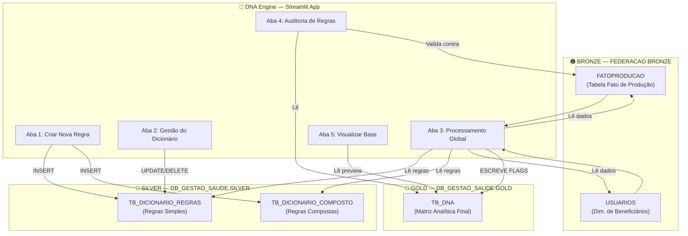

### Estrutura de Arquivos

```
app/
├── streamlit_app.py            # Orquestrador principal — monta as 5 abas
├── config.py                   # Centralização de nomes de banco/schema/tabela
├── funcoes_execucao_regras.py  # Aba 1: Formulário de criação de regras
├── funcoes_gestao_dicionario.py# Aba 2: Editor e exclusão de regras
├── funcoes_gestao_total_dna.py # Aba 3 + Motores de Processamento (Fase 1 e 2)
├── funcoes_auditoria_regras.py # Aba 4: Auditoria paciente × regra
├── funcoes_visualizacao_dados.py# Aba 5: Preview da tabela Gold
├── setup_banco_dna.sql         # Script DDL para criação das tabelas
├── setup_infraestrutura_dna.sql# Stored Procedures legadas (referência histórica)
└── environment.yml             # Dependências Python do ambiente Snowflake

scripts/
├── pipeline_risco_mama_v3.py   # Pipeline de risco mama v3 com score e flags inferidas
├── clinical_chain_detector.py  # Inferência de cadeias clínicas temporais
└── __init__.py                 # Permite importação do diretório como pacote
```

---

## Pipeline adicional — Risco Mama

O repositório também inclui `scripts/pipeline_risco_mama_v3.py`, um pipeline específico para risco mama, apoiado pelo módulo `scripts/clinical_chain_detector.py`.

As novas flags inferidas por cadeia temporal são:

- `MAMOGRAFIA_RESULTADO_INFERIDO_ALTERADO`
- `BRCA_POSITIVO_INFERIDO`
- `CADEIA_INVESTIGACAO_ONCOLOGICA`
- `INVESTIGACAO_POS_BRCA`
- `PARTO_PRIMIPARO_APOS_30`

Os pesos dessas flags podem ser agregados ao score final via configuração do pipeline.

---

## 3. Modelo de Dados

### 3.1 Diagrama Entidade-Relacionamento (ERD)

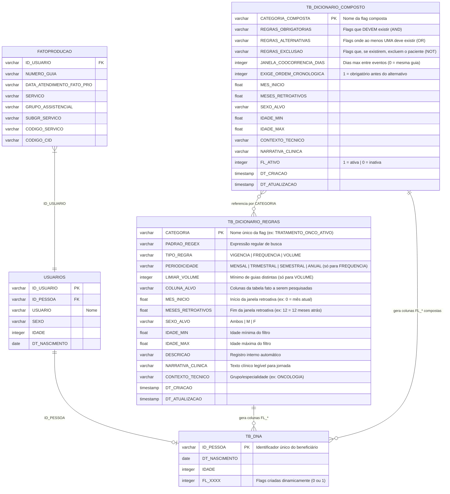

### 3.2 Descrição das Tabelas

#### `TB_DICIONARIO_REGRAS` (Silver)
Armazena cada **regra simples** — a unidade básica de inteligência. Cada linha define:
- **O quê buscar** (`PADRAO_REGEX` aplicado em `COLUNA_ALVO`)
- **Quando buscar** (janela de meses retroativos: `MES_INICIO` → `MESES_RETROATIVOS`)
- **Para quem** (filtros de `SEXO_ALVO`, `IDADE_MIN`, `IDADE_MAX`)
- **Como classificar** (`TIPO_REGRA`: vigência, frequência ou volume)

#### `TB_DICIONARIO_COMPOSTO` (Silver)
Armazena **protocolos clínicos** — combinações lógicas de regras simples:
- **AND**: todas as regras obrigatórias devem estar presentes
- **OR**: pelo menos uma das regras alternativas deve estar presente
- **NOT**: a regra de exclusão não pode existir
- **Co-ocorrência**: os eventos podem ter que ocorrer dentro de uma janela de dias

#### `TB_DNA` (Gold)
A tabela de saída final. Começa com apenas 3 colunas (`ID_PESSOA`, `DT_NASCIMENTO`, `IDADE`) e **cresce automaticamente** com colunas `FL_*` conforme novas regras são cadastradas e processadas.

---

## 4. Configuração e Instalação

### 4.1 Pré-requisitos

- Conta Snowflake ativa com permissões de criação de objetos
- Snowflake Streamlit habilitado (Snowpark Container Services ou Streamlit in Snowflake)
- Bancos de dados `DB_GESTAO_SAUDE` e `FEDERACAO` criados

### 4.2 Diagrama de Setup Inicial

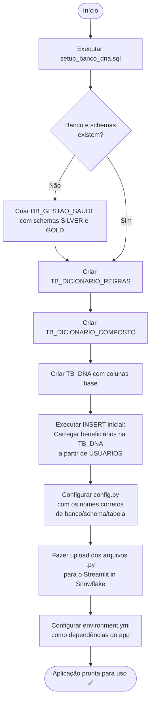

### 4.3 Adaptação do `config.py`

Ao mudar de ambiente (Dev → Prod) ou de cliente, edite **apenas** o arquivo `config.py`:

```python
# Exemplo de adaptação para novo cliente:
DATABASE = "DB_CLIENTE_XYZ"          # ← altere aqui
SCHEMA_SILVER = f"{DATABASE}.SILVER"
SCHEMA_GOLD   = f"{DATABASE}.GOLD"

DATABASE_FEDERACAO = "FEDERACAO_XYZ"  # ← altere aqui
SCHEMA_BRONZE_FEDERACAO = f"{DATABASE_FEDERACAO}.BRONZE"
```

> **Regra de ouro:** Nenhum outro arquivo Python precisa ser alterado ao trocar de ambiente. Todo o mapeamento está centralizado em `config.py`.

### 4.4 Variáveis de Configuração

| Variável | Valor Padrão | Descrição |
|---|---|---|
| `DATABASE` | `DB_GESTAO_SAUDE` | Banco principal de saúde |
| `SCHEMA_SILVER` | `DB_GESTAO_SAUDE.SILVER` | Camada Silver (dicionários) |
| `SCHEMA_GOLD` | `DB_GESTAO_SAUDE.GOLD` | Camada Gold (tabela DNA final) |
| `DATABASE_FEDERACAO` | `FEDERACAO` | Banco de origem dos dados brutos |
| `SCHEMA_BRONZE_FEDERACAO` | `FEDERACAO.BRONZE` | Camada Bronze (dados crus) |
| `TABELA_FATO_PRODUCAO` | `FEDERACAO.BRONZE.FATOPRODUCAO` | Tabela fato de produção assistencial |
| `TABELA_DIM_USUARIO` | `FEDERACAO.BRONZE.USUARIOS` | Dimensão de beneficiários |
| `TABELA_DICIONARIO` | `DB_GESTAO_SAUDE.SILVER.TB_DICIONARIO_REGRAS` | Regras simples |
| `TABELA_DICIONARIO_COMPOSTO` | `DB_GESTAO_SAUDE.SILVER.TB_DICIONARIO_COMPOSTO` | Regras compostas |
| `TABELA_DNA` | `DB_GESTAO_SAUDE.GOLD.TB_DNA` | Matriz DNA final |
| `DATA_ATENDIMENTO` | `TRY_TO_DATE(DATA_ATENDIMENTO_FATO_PRO, 'DD/MM/YYYY')` | Expressão SQL da data de atendimento |

---

## 5. Fluxo Geral da Aplicação

### 5.1 Navegação Principal

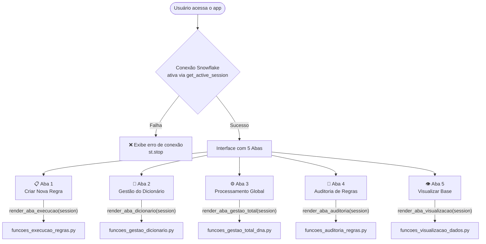

### 5.2 Ciclo de Vida Completo de uma Regra

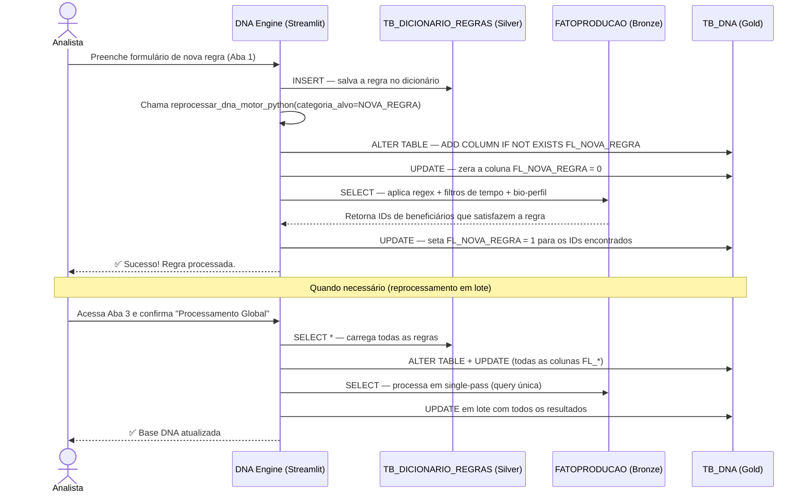

---

## 6. Aba 1 — Criar Nova Regra

**Arquivo:** `funcoes_execucao_regras.py`  
**Função principal:** `render_aba_execucao(session)`

Esta aba permite ao analista criar inteligências (flags) que serão aplicadas sobre a base de dados. Há dois modos de criação: **Regra Simples** e **Regra Composta**.

### 6.1 Regra Simples

Uma Regra Simples detecta um **evento único** nos dados de produção, com base em expressões regulares (Regex), filtros de tempo e filtros de perfil biológico.

#### Tipos de Regra Simples

| Tipo | Lógica | Quando usar |
|---|---|---|
| **VIGENCIA** | Verifica se houve **ao menos um** evento dentro da janela de tempo | Detectar se o paciente fez algum procedimento no período |
| **FREQUENCIA** | Verifica se o evento ocorreu em **múltiplos períodos** (mensal/trimestral/semestral/anual) | Detectar uso contínuo de medicamentos, exames periódicos |
| **VOLUME** | Verifica se o número de guias distintas **atinge um limiar mínimo** | Detectar uso intenso de um serviço específico |

#### Fluxo de Criação de Regra Simples

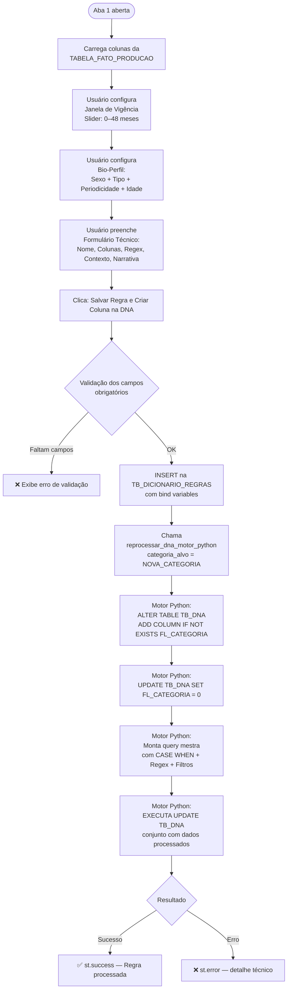

#### Campos do Formulário (Regra Simples)

| Campo | Obrigatório | Descrição |
|---|---|---|
| **Nome da Flag** (`CATEGORIA`) | ✅ | Identificador único. O sistema adiciona `FL_` automaticamente se não informado. Ex: `TRATAMENTO_ONCO_ATIVO` → coluna `FL_TRATAMENTO_ONCO_ATIVO` |
| **Janela de Vigência** | ✅ | Slider de 0 a 48 meses. Define o intervalo retroativo de busca. Ex: `(0, 3)` = últimos 3 meses. |
| **Sexo Alvo** | ✅ | `Ambos`, `M` ou `F` |
| **Tipo de Regra** | ✅ | `VIGENCIA`, `FREQUENCIA` ou `VOLUME` |
| **Periodicidade** | Condicional | Apenas para `FREQUENCIA`: `MENSAL`, `TRIMESTRAL`, `SEMESTRAL`, `ANUAL` |
| **Mínimo de Guias** | Condicional | Apenas para `VOLUME`: número inteiro ≥ 1 |
| **Filtro de Idade** | ✅ | `Sem Filtro`, `Idade Específica` ou `Faixa Etária` |
| **Colunas de Busca** | ✅ | Seleção múltipla das colunas da tabela fato onde o Regex será aplicado |
| **Padrão Regex** | ✅ | Expressão regular. Ex: `ONCOLOG\|QUIMIO\|RADIOTERAP` |
| **Contexto Técnico** | ✅ | Agrupador da regra. Ex: `ONCOLOGIA`, `CARDIOLOGIA` |
| **Narrativa Clínica** | ✅ | Texto humano que descreve o critério. Usado em jornadas do paciente |

### 6.2 Regra Composta

Uma Regra Composta (Protocolo Avançado) combina **múltiplas regras simples** usando lógica booleana, podendo exigir **co-ocorrência temporal** dos eventos.

#### Lógica do Protocolo

```
Resultado Final = (TODAS as Regras Obrigatórias [AND])
               E (PELO MENOS UMA Regra Alternativa [OR])
               E NÃO (NENHUMA Regra de Exclusão [NOT])
```

#### Fluxo de Criação de Regra Composta

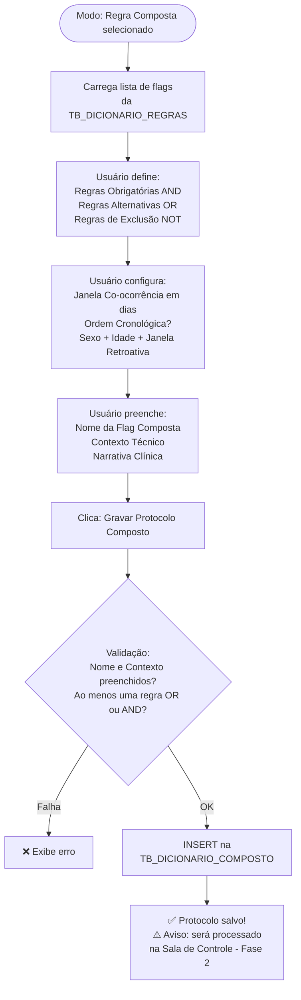

> **Importante:** Ao salvar uma Regra Composta, ela é inserida no dicionário, mas o processamento (criação da coluna FL_* e atualização da TB_DNA) **só ocorre na Aba 3 — Processamento Global** (Motor Fase 2). Isso é diferente das Regras Simples, que são processadas imediatamente ao salvar.

#### Campos do Formulário (Regra Composta)

| Campo | Obrigatório | Descrição |
|---|---|---|
| **Obrigatório ter (AND)** | Condicional* | Flags que **todas** devem estar ativas. Pelo menos AND ou OR devem ser preenchidos |
| **Alternativo ter (OR)** | Condicional* | Flags onde **ao menos uma** deve estar ativa |
| **NÃO pode ter (NOT)** | Não | Flags que, se ativas, **excluem** o beneficiário desta regra composta |
| **Janela de Co-ocorrência (dias)** | ✅ | `0` = mesma guia; `N` = eventos podem ter até N dias de distância |
| **Exige Ordem Cronológica** | ✅ | Checkbox: se marcado, o evento Obrigatório deve ocorrer **antes** do Alternativo |
| **Sexo Alvo** | ✅ | `Ambos`, `M` ou `F` |
| **Idade Mín / Máx** | ✅ | Faixa etária para aplicação do protocolo |
| **Janela Retroativa (meses)** | ✅ | Período de busca dos eventos. Slider 0–48 meses |
| **Nome da Flag Composta** | ✅ | Ex: `FL_RASTREIO_RENAL` |
| **Contexto Técnico** | ✅ | Agrupador. Ex: `PREVENTIVA` |
| **Narrativa Clínica** | Não | Descrição em linguagem natural do protocolo |

---

## 7. Aba 2 — Gestão do Dicionário

**Arquivo:** `funcoes_gestao_dicionario.py`  
**Função principal:** `render_aba_dicionario(session)`

Esta aba permite visualizar, editar e excluir as regras simples existentes no dicionário.

### Fluxo Completo da Gestão do Dicionário

```mermaid
flowchart TD
    A([Aba 2 aberta]) --> B[SELECT * FROM TB_DICIONARIO_REGRAS\nORDER BY CATEGORIA]
    B --> C{Dicionário\nvazio?}
    C -->|Sim| INFO[ℹ️ Nenhuma inteligência\nmapeada no momento]
    C -->|Não| D[Exibe tabela editável\ncom st.data_editor]

    D --> E{Usuário editou\nalguma linha?}
    E -->|Clicou Salvar Alterações| F[Detecta linhas alteradas\ncomparando df_original vs df_editado]
    F --> G{Há mudanças?}
    G -->|Não| WARN[⚠️ Nenhuma alteração detectada]
    G -->|Sim| H[Para cada linha alterada:\nUPDATE TB_DICIONARIO_REGRAS\nSET campos = ?\nWHERE CATEGORIA = ?]
    H --> I[✅ N regra(s) atualizada(s)]
    I --> J[st.rerun — recarrega a tela]

    D --> K[Seção: Apagar Regras]
    K --> L[Selectbox com todas as\nCATEGORIAS do dicionário]
    L --> M{Usuário selecionou\numa regra?}
    M -->|Sim| N[⚠️ Exibe aviso de consequências]
    N --> O{Clicou em\nConfirmar Exclusão?}
    O -->|Sim| P[DELETE FROM TB_DICIONARIO_REGRAS\nWHERE CATEGORIA = ?]
    P --> Q[✅ / ❌ Feedback + st.rerun]
```

### Campos Editáveis no Dicionário

| Coluna | Editável | Observação |
|---|---|---|
| `CATEGORIA` | ❌ | Chave primária — bloqueada para edição |
| `TIPO_REGRA` | ❌ | Definido na criação |
| `PERIODICIDADE` | ❌ | Definido na criação |
| `LIMIAR_VOLUME` | ✅ | Apenas relevante para regras VOLUME |
| `CONTEXTO_TECNICO` | ✅ | Agrupador editável |
| `COLUNA_ALVO` | ✅ | Colunas de busca separadas por vírgula |
| `MES_INICIO` | ✅ | Início da janela retroativa |
| `MESES_RETROATIVOS` | ✅ | Fim da janela retroativa |
| `PADRAO_REGEX` | ✅ | Expressão regular de busca |
| `NARRATIVA_CLINICA` | ✅ | Texto clínico |
| `DESCRICAO` | ✅ | Registro interno |

> **Atenção:** Editar uma regra **não** reprocessa automaticamente a tabela DNA. Após editar, é necessário ir à **Aba 3 (Processamento Global)** para aplicar as mudanças.

> **Atenção:** Excluir uma regra **remove** ela do dicionário e ela **não será mais processada** nos próximos lotes. Porém, a coluna `FL_*` correspondente **permanece na tabela DNA** (o histórico é preservado).

---

## 8. Aba 3 — Processamento Global (Sala de Controle)

**Arquivo:** `funcoes_gestao_total_dna.py`  
**Funções:** `render_aba_gestao_total(session)`, `reprocessar_dna_motor_python(session, categoria_alvo)`, `reprocessar_dna_motor_composto(session, categoria_alvo)`

Esta aba é o **coração do sistema**. Aqui ocorre o reprocessamento completo da Matriz DNA, atualizando **todas as flags** para **todos os beneficiários**.

### Fluxo da Interface da Sala de Controle

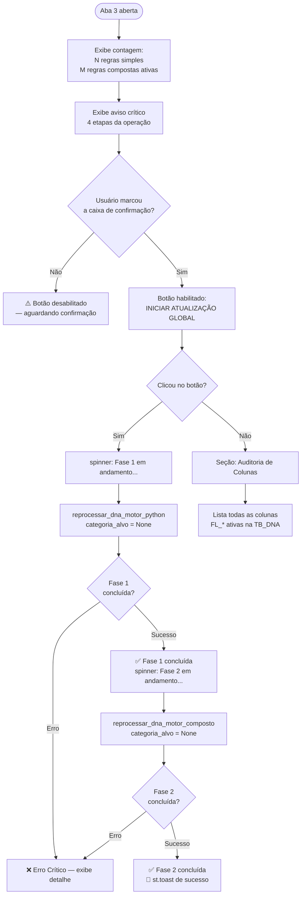

### 8.1 Motor Fase 1 — Regras Simples

**Função:** `reprocessar_dna_motor_python(session, categoria_alvo=None)`

Esta função é o **Motor Principal** do DNA Engine. Opera em um único passe SQL (Single-Pass) sobre a base de dados, processando todas as regras simples em uma única query de UPDATE.

#### Algoritmo do Motor Fase 1

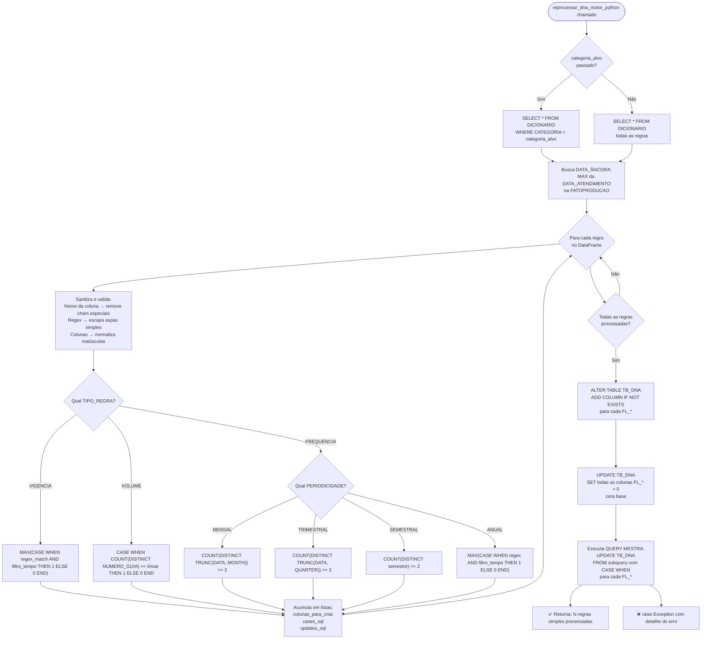

#### Query Mestra do Motor Fase 1 (Estrutura Simplificada)

```sql
-- Estrutura da Query Single-Pass gerada pelo motor
UPDATE TB_DNA DNA
SET
    FL_REGRA_1 = DADOS_PROCESSADOS.FL_REGRA_1,
    FL_REGRA_2 = DADOS_PROCESSADOS.FL_REGRA_2,
    -- ... N colunas
FROM (
    WITH DADOS_PROCESSADOS AS (
        SELECT
            M.ID_PESSOA,
            -- Regra tipo VIGENCIA:
            MAX(CASE WHEN REGEXP_LIKE(F.SERVICO, 'ONCOLOG|QUIMIO', 'i')
                          AND DATEDIFF('month', F.DATA, data_ancora) BETWEEN 0 AND 3
                          AND (M.SEXO = 'Ambos' OR M.SEXO = 'M')
                          AND M.IDADE BETWEEN 0 AND 200
                     THEN 1 ELSE 0 END) AS FL_REGRA_1,
            -- Regra tipo VOLUME:
            CASE WHEN COUNT(DISTINCT CASE WHEN REGEXP_LIKE(F.CODIGO_CID, 'E11', 'i')
                                               AND DATEDIFF('month', ...) BETWEEN 0 AND 12
                                          THEN F.NUMERO_GUIA END) >= 5
                 THEN 1 ELSE 0 END AS FL_REGRA_2
        FROM FATOPRODUCAO F
        INNER JOIN USUARIOS M ON F.ID_USUARIO = M.ID_USUARIO
        GROUP BY M.ID_PESSOA
    )
    SELECT * FROM DADOS_PROCESSADOS
) DADOS_PROCESSADOS
WHERE CAST(DNA.ID_PESSOA AS VARCHAR) = CAST(DADOS_PROCESSADOS.ID_PESSOA AS VARCHAR)
```

### 8.2 Motor Fase 2 — Regras Compostas

**Função:** `reprocessar_dna_motor_composto(session, categoria_alvo=None)`

Este motor processa os **Protocolos Compostos**, que exigem cruzamento de múltiplos eventos por beneficiário com validação de janela temporal.

#### Algoritmo do Motor Fase 2

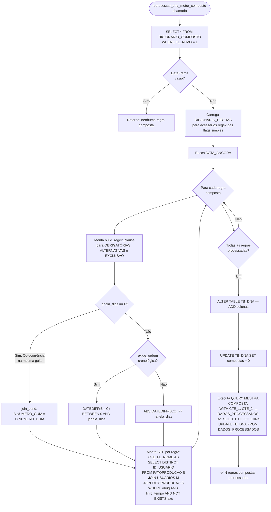

#### Lógica do Self-Join para Co-ocorrência

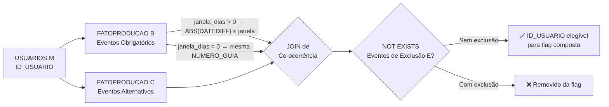

---

## 9. Aba 4 — Auditoria de Regras

**Arquivo:** `funcoes_auditoria_regras.py`  
**Função principal:** `render_aba_auditoria(session)`

Esta aba permite validar se um beneficiário que está com a flag `= 1` na TB_DNA possui, de fato, os registros na base de produção que justificam aquela flag. É a **prova real** da inteligência.

### Fluxo de Auditoria

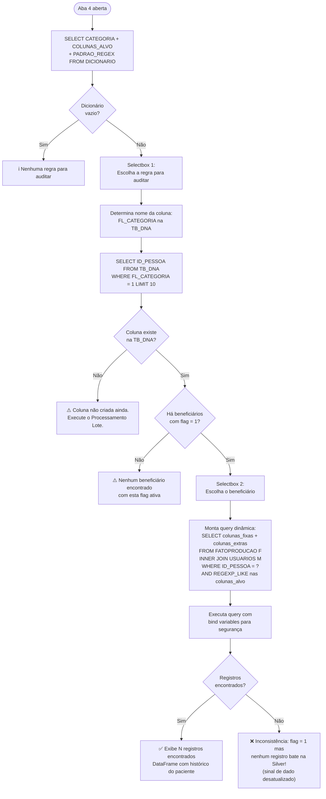

### Colunas Exibidas na Auditoria

A tabela de evidências exibe sempre as colunas fixas a seguir, mais eventuais colunas extras definidas na regra:

| Coluna | Fonte | Descrição |
|---|---|---|
| `ID_USUARIO` | FATOPRODUCAO | Identificador do usuário na transação |
| `USUARIO` | USUARIOS | Nome do beneficiário |
| `DATA_ATENDIMENTO` | FATOPRODUCAO | Data do atendimento formatada DD/MM/YYYY |
| `NUMERO_GUIA` | FATOPRODUCAO | Número da guia de autorização |
| `SERVICO` | FATOPRODUCAO | Serviço prestado |
| `SUBGR_SERVICO` | FATOPRODUCAO | Subgrupo do serviço |
| `GR_BENEFICIOS` | FATOPRODUCAO | Grupo de benefícios |
| `CODIGO_CID` | FATOPRODUCAO | CID-10 do atendimento |

---

## 10. Aba 5 — Visualizar Base

**Arquivo:** `funcoes_visualizacao_dados.py`  
**Função principal:** `render_aba_visualizacao(session)`

Esta aba oferece uma **prévia interativa** da tabela `TB_DNA` com controle de quantidade de registros.

### Fluxo de Visualização

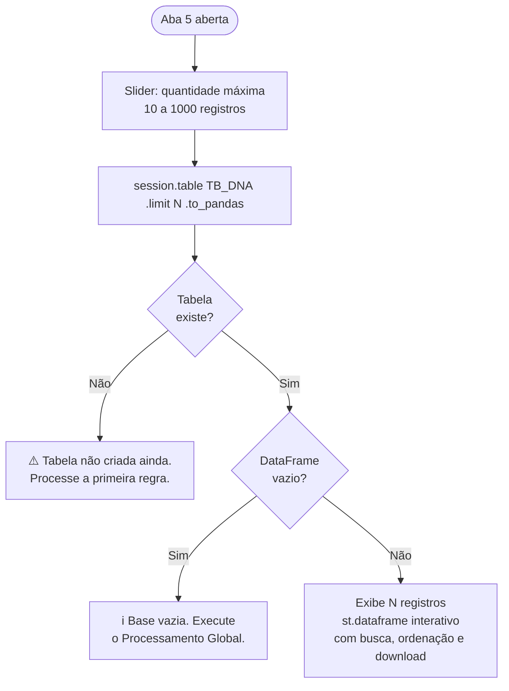

---

## 11. Referência Técnica das Funções

### `reprocessar_dna_motor_python(session, categoria_alvo=None)`

| Atributo | Valor |
|---|---|
| **Arquivo** | `funcoes_gestao_total_dna.py` |
| **Propósito** | Processar regras simples e atualizar a TB_DNA |
| **Parâmetro `categoria_alvo`** | Se `None` → processa todas as regras; se informado → processa apenas aquela categoria |
| **Retorno (sucesso)** | String: `"Sucesso! N regras simples processadas."` |
| **Retorno (erro)** | Levanta `Exception` com detalhe do erro |
| **Segurança** | Sanitização de nomes de colunas com `re.sub(r'[^A-Z0-9_]', '', ...)` para evitar SQL Injection |
| **Otimização** | Single-Pass: uma única query UPDATE processa todas as regras simultaneamente via CASE WHEN |

### `reprocessar_dna_motor_composto(session, categoria_alvo=None)`

| Atributo | Valor |
|---|---|
| **Arquivo** | `funcoes_gestao_total_dna.py` |
| **Propósito** | Processar protocolos compostos e atualizar a TB_DNA com flags de co-ocorrência |
| **Parâmetro `categoria_alvo`** | Se `None` → todas as compostas ativas; se informado → apenas aquela |
| **Retorno (sucesso)** | String: `"Sucesso! N regras compostas processadas."` |
| **Técnica SQL** | CTEs com Self-Join na FATOPRODUCAO para detectar co-ocorrência temporal |
| **Função auxiliar interna** | `build_regex_clause(lista_categorias_str, alias)` — converte lista de flags em cláusulas REGEXP_LIKE |

### `render_aba_execucao(session)`

| Atributo | Valor |
|---|---|
| **Arquivo** | `funcoes_execucao_regras.py` |
| **Propósito** | Renderiza o formulário de criação de regras (Aba 1) |
| **Dependência** | Importa `reprocessar_dna_motor_python` de `funcoes_gestao_total_dna` |
| **Segurança** | Usa bind variables (`?`) em todos os INSERTs para prevenir SQL Injection |

### `render_aba_dicionario(session)`

| Atributo | Valor |
|---|---|
| **Arquivo** | `funcoes_gestao_dicionario.py` |
| **Propósito** | Exibe, edita e exclui regras do dicionário (Aba 2) |
| **Mecanismo de detecção de mudanças** | `df_editado[df_dic.ne(df_editado).any(axis=1)]` — compara DataFrames Pandas |

### `render_aba_gestao_total(session)`

| Atributo | Valor |
|---|---|
| **Arquivo** | `funcoes_gestao_total_dna.py` |
| **Propósito** | Interface da Sala de Controle (Aba 3) com dupla confirmação de segurança |

### `render_aba_auditoria(session)`

| Atributo | Valor |
|---|---|
| **Arquivo** | `funcoes_auditoria_regras.py` |
| **Propósito** | Auditoria cruzada: DNA vs. base de produção (Aba 4) |
| **Segurança** | Bind variables em todos os parâmetros da query de auditoria |

### `render_aba_visualizacao(session)`

| Atributo | Valor |
|---|---|
| **Arquivo** | `funcoes_visualizacao_dados.py` |
| **Propósito** | Preview paginado da tabela TB_DNA (Aba 5) |

---

## 12. Glossário

| Termo | Definição |
|---|---|
| **DNA Engine** | Nome do sistema. Analogia à estrutura genética: cada flag é um "gene" que descreve a saúde/comportamento do beneficiário. |
| **Flag / `FL_*`** | Coluna booleana (0 ou 1) na tabela TB_DNA que indica se um critério foi satisfeito. |
| **Regra Simples** | Inteligência baseada em um único tipo de evento, detectado por regex em colunas da tabela fato. |
| **Regra Composta** | Protocolo que combina múltiplas regras simples com lógica AND/OR/NOT e co-ocorrência temporal. |
| **Janela de Vigência** | Intervalo de meses retroativos para busca de eventos. Ex: `-0 a -3 meses` = últimos 3 meses. |
| **Data Âncora** | A data mais recente registrada na tabela fato. Serve como referência para cálculo da janela retroativa. |
| **Co-ocorrência** | Dois ou mais eventos de saúde que ocorrem dentro de uma mesma janela de tempo (ou na mesma guia). |
| **Bio-Filtro** | Combinação de filtros de Sexo e Idade que restringe a aplicação de uma regra a um subgrupo específico. |
| **Single-Pass** | Técnica de otimização onde todas as regras são processadas em uma única query SQL, evitando múltiplas varreduras na tabela fato. |
| **Bind Variable** | Parâmetro `?` em queries SQL que previne SQL Injection, separando o código SQL dos dados. |
| **Camada Bronze** | Dados brutos de origem (FEDERACAO.BRONZE) — sem transformação. |
| **Camada Silver** | Dados curados e dicionários de regras (DB_GESTAO_SAUDE.SILVER). |
| **Camada Gold** | Produto analítico final — a Matriz DNA (DB_GESTAO_SAUDE.GOLD). |
| **Matriz DNA / TB_DNA** | A tabela Gold que agrega a visão analítica de cada beneficiário com todas as suas flags. |
| **CTE** | Common Table Expression — subquery nomeada usada para organizar queries SQL complexas. |
| **Regex / REGEXP_LIKE** | Expressão regular usada para busca de padrões textuais nas colunas da tabela fato. |
| **Snowpark** | API Python da Snowflake que permite executar operações diretamente no engine do Snowflake, sem mover dados. |

---

## 13. Guia do Operador (Usuário Final)

### Checklist de Operação Diária / Mensal

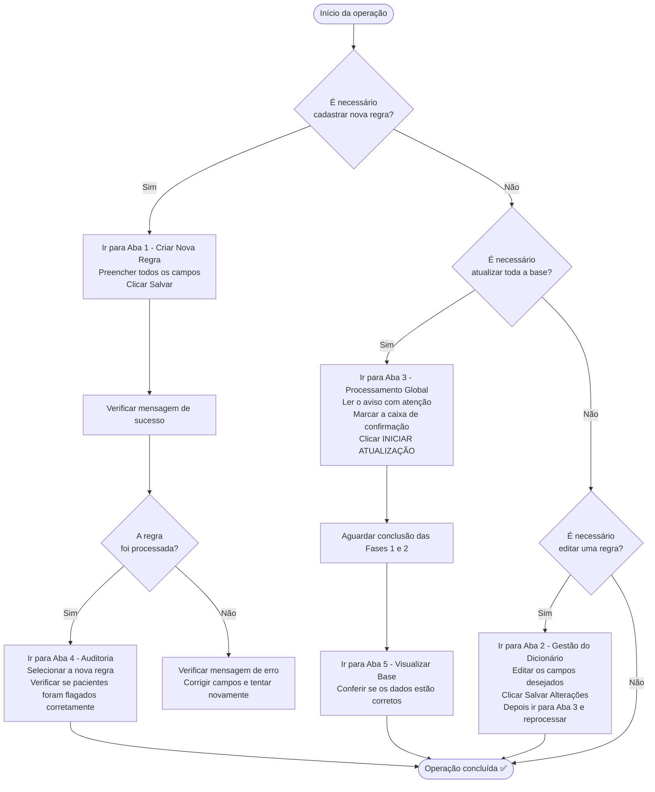

### Passo a Passo: Criando Sua Primeira Regra

1. **Acesse a Aba 1 — "Criar Nova Regra".**
2. Selecione o modo **"Regra Simples"**.
3. Defina a **Janela de Vigência**: para buscar eventos dos últimos 6 meses, coloque o slider em `(0, 6)`.
4. Escolha o **Sexo Alvo** e o **Tipo de Regra** (normalmente `VIGENCIA` para o início).
5. No formulário:
   - **Nome da Flag:** Ex: `DIABETICO_ATIVO` (o sistema cria automaticamente `FL_DIABETICO_ATIVO`)
   - **Colunas de Busca:** selecione `CODIGO_CID` e/ou `SERVICO`
   - **Padrão Regex:** Ex: `E10|E11|E12|E13|E14` (CIDs de diabetes)
   - **Contexto Técnico:** `DIABETES`
   - **Narrativa Clínica:** `Identifica beneficiários com diagnóstico ou procedimento relacionado a diabetes no período selecionado.`
6. Clique em **"Salvar Regra e Criar Coluna na DNA"**.
7. Aguarde a mensagem de sucesso.
8. Vá para a **Aba 4 — Auditoria** para verificar se os pacientes foram corretamente identificados.

### Boas Práticas

- **Nomeação de flags:** Use nomes claros e com contexto. Ex: `FL_ONCOLOGIA_ATIVA_3M` é melhor que `FL_ONCO`.
- **Regex:** Teste seus padrões antes de salvar. Use `|` para "OU". Ex: `QUIMIO|RADIOT|ONCOL`.
- **Janela de tempo:** Defina a janela conforme o critério clínico, não maior do que necessário.
- **Reprocessamento global:** Faça apenas quando necessário (mudança de muitas regras ou atualização mensal). É uma operação custosa.
- **Auditoria:** Sempre audite novas regras antes de usar os dados em produção.
- **Exclusão de regras:** Seja cauteloso. A coluna permanece na TB_DNA, mas a regra deixa de ser atualizada.

---

## 14. Guia do Desenvolvedor

### Como Adicionar uma Nova Aba

1. Crie um novo arquivo Python: `funcoes_nova_funcionalidade.py`
2. Implemente a função `render_aba_nova(session)` com a lógica da aba.
3. Em `streamlit_app.py`, adicione a importação e a aba:
   ```python
   from funcoes_nova_funcionalidade import render_aba_nova
   # ...
   t_nova = st.tabs([..., "Nova Funcionalidade"])
   with t_nova:
       render_aba_nova(session)
   ```

### Como Adicionar uma Nova Tabela Fonte

1. Declare as constantes em `config.py`:
   ```python
   TABELA_NOVA_FONTE = f"{SCHEMA_BRONZE_FEDERACAO}.TB_NOVA_FONTE"
   ```
2. Importe no módulo que precisar e use normalmente.

### Padrões de Segurança Obrigatórios

**Sempre use bind variables (`?`) para queries com entrada do usuário:**

```python
# ✅ CORRETO — seguro contra SQL Injection
session.sql("SELECT * FROM TABELA WHERE CATEGORIA = ?", params=[categoria]).collect()

# ❌ ERRADO — vulnerável a SQL Injection
session.sql(f"SELECT * FROM TABELA WHERE CATEGORIA = '{categoria}'").collect()
```

**Sempre sanitize nomes de colunas gerados dinamicamente:**

```python
# ✅ CORRETO — remove caracteres não alfanuméricos
nome_col = re.sub(r'[^A-Z0-9_]', '', nome_col.upper())

# ❌ ERRADO — permite injeção de SQL via nome da coluna
nome_col = user_input.upper()
```

### Como o Motor Single-Pass Funciona

A otimização central do DNA Engine é o conceito de **Single-Pass**: em vez de executar N queries de UPDATE (uma por regra), o motor:

1. Acumula todas as expressões `CASE WHEN` em uma lista Python.
2. Constrói **uma única query SQL** que avalia todos os casos simultaneamente em uma subquery CTE.
3. Executa um **único UPDATE** na TB_DNA com todos os resultados.

Isso reduz o tempo de processamento de `O(N × scan_da_tabela)` para `O(1 × scan_da_tabela)`, sendo N o número de regras.

### Estratégia de Atualização Incremental vs. Global

| Cenário | Estratégia |
|---|---|
| Nova regra criada (Aba 1) | `reprocessar_dna_motor_python(session, categoria_alvo="FL_NOVA")` — processa apenas a nova regra |
| Regra editada no dicionário | Ir para Aba 3 → Processamento Global (não há atalho para edição isolada) |
| Atualização mensal completa | Aba 3 → Processamento Global → Fase 1 + Fase 2 |

### Tratamento de Erros

- Todas as funções `render_aba_*` usam `try/except` e exibem erros amigáveis via `st.error()`.
- Os motores de processamento levantam `Exception` com mensagem detalhada para que a interface possa exibir o problema.
- A auditoria trata o caso de coluna inexistente na TB_DNA separadamente (flag ainda não processada).

### Dependências (`environment.yml`)

```yaml
dependencies:
  - python=3.11.*
  - snowflake-snowpark-python   # Integração Snowflake + Python
  - streamlit                   # Interface visual
  - pandas                      # Manipulação de DataFrames para comparação de dados
```

> Para adicionar novas bibliotecas (ex: plotly para gráficos), descomente ou adicione a linha em `environment.yml` e faça o deploy novamente.

---

*Documentação gerada para o projeto DNA Engine — Vanilson da Silva. Para dúvidas técnicas, consulte os arquivos-fonte no repositório.*
